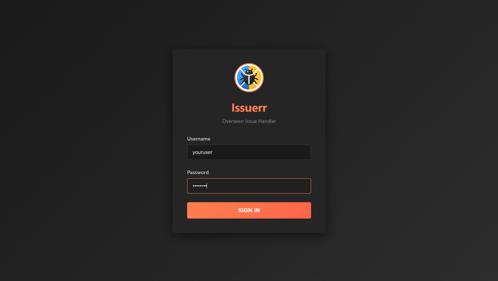
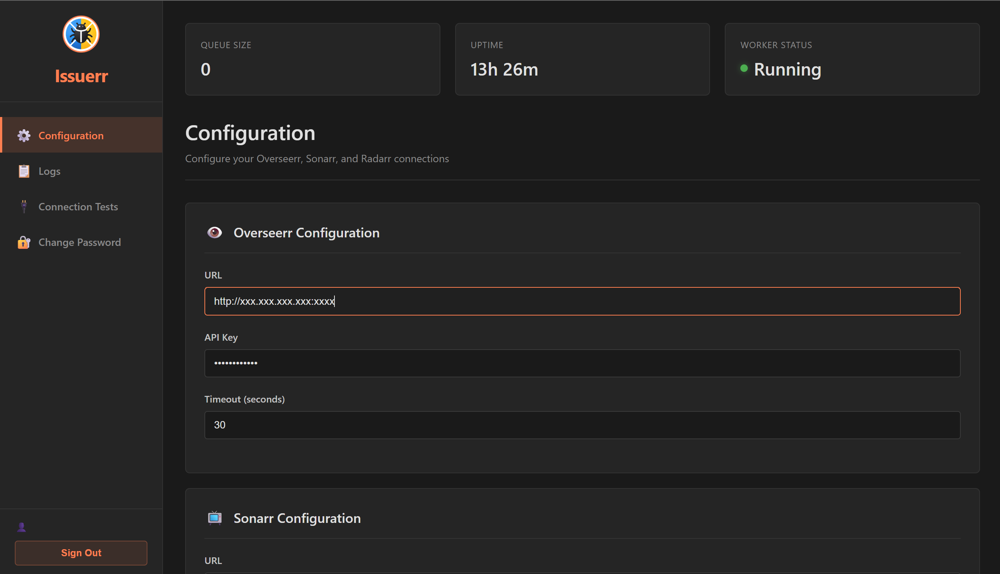
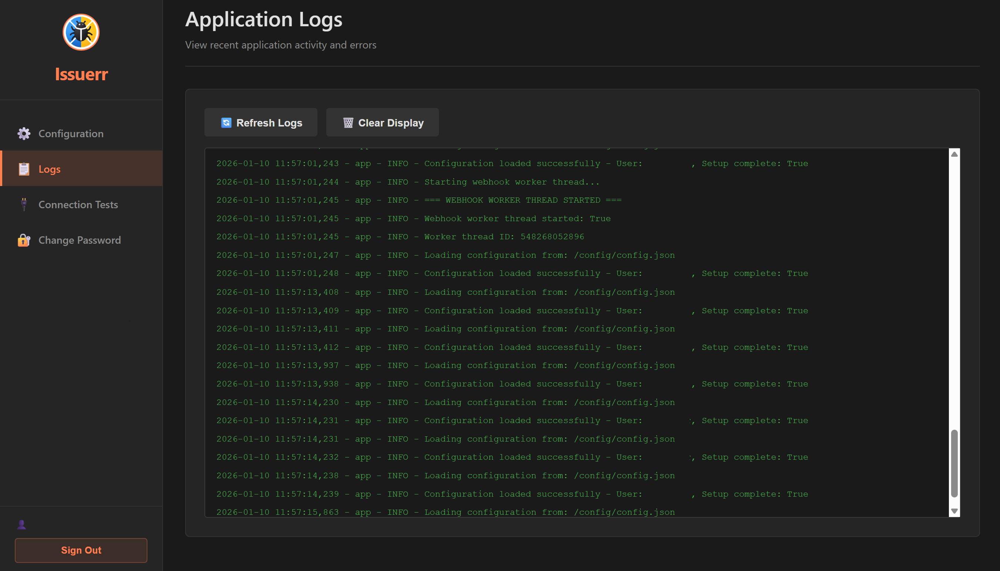

# Issuerr

<p align="center">
  
</p>

<p align="center">
  <strong>Automated issue handler for Overseerr, Sonarr & Radarr</strong>
</p>

<p align="center">
  <a href="#features">Features</a> •
  <a href="#installation">Installation</a> •
  <a href="#configuration">Configuration</a> •
  <a href="#usage">Usage</a> •
  <a href="#reverse-proxy">Reverse Proxy</a> •
  <a href="#troubleshooting">Troubleshooting</a>
</p>

---

## Overview

**Issuerr** automatically handles media quality issues reported through [Overseerr](https://overseerr.dev/). When a user reports an issue with a movie or TV episode, Issuerr automatically:

1. Deletes the problematic media file from Radarr/Sonarr
2. Marks the download history as failed
3. Triggers a new search for a better quality release
4. Comments on the issue in Overseerr
5. Closes the issue automatically

This eliminates the manual workflow of handling quality complaints and re-downloading media.

## Features

- 🎬 **Automatic Issue Resolution** - Handles movie and TV show issues automatically
- 🔐 **Secure Web Dashboard** - Password-protected configuration interface
- 🌐 **Webhook Integration** - Receives notifications directly from Overseerr
- 📊 **Real-time Logging** - View processing logs from the dashboard
- 🔄 **Queue System** - Reliable asynchronous webhook processing
- 🐳 **Docker Ready** - Simple deployment with Docker Compose
- 🔒 **Security First** - bcrypt password hashing, rate limiting, secure session handling

## Screenshots

<details>
<summary>Click to view screenshots</summary>

### Login


### Configuration


### Logs


</details>

## Requirements

- Docker and Docker Compose
- Overseerr instance with webhook support
- Sonarr v3+ (for TV shows)
- Radarr v3+ (for movies)
- API keys for all services

## Installation

### Quick Start with Docker Compose

1. **Create the directory structure:**
   ```bash
   mkdir -p ~/issuerr/config
   cd ~/issuerr
   ```

2. **Create `docker-compose.yml`:**
   ```yaml
   version: '3.8'

   services:
     issuerr:
       image: ghcr.io/diytechtrek/issuerr:latest
       container_name: issuerr
       ports:
         - "5000:5000"
       volumes:
         - ./config:/config
       restart: unless-stopped
       environment:
         - TZ=Australia/Melbourne  # Set your timezone
         - PUID=1000  # Your user ID (run: id -u)
         - PGID=1000  # Your group ID (run: id -g)
   ```

3. **Start the container:**
   ```bash
   docker-compose up -d
   ```

4. **Access the setup wizard:**
   
   Open `http://your-server-ip:5000` in your browser to complete initial setup.

### Building from Source

```bash
# Clone the repository
git clone https://github.com/diytechtrek/issuerr.git
cd issuerr

# Build and start
docker-compose up -d --build
```

## Configuration

### Initial Setup

On first launch, you'll be prompted to create an administrator account:

1. Navigate to `http://your-server-ip:5000`
2. Create a username (minimum 3 characters)
3. Create a strong password (checked with real-time strength meter)
4. Complete setup

### Service Configuration

After logging in, configure your services in the Settings tab:

#### Overseerr
| Setting | Description |
|---------|-------------|
| URL | Full URL to your Overseerr instance (e.g., `http://overseerr:5055`) |
| API Key | Found in Overseerr → Settings → General |
| Timeout | Request timeout in seconds (default: 30) |

#### Sonarr
| Setting | Description |
|---------|-------------|
| URL | Full URL to your Sonarr instance (e.g., `http://sonarr:8989`) |
| API Key | Found in Sonarr → Settings → General → Security |
| Timeout | Request timeout in seconds (default: 30) |

#### Radarr
| Setting | Description |
|---------|-------------|
| URL | Full URL to your Radarr instance (e.g., `http://radarr:7878`) |
| API Key | Found in Radarr → Settings → General → Security |
| Timeout | Request timeout in seconds (default: 30) |

### Overseerr Webhook Setup

1. In Overseerr, go to **Settings → Notifications → Webhook**
2. Enable the webhook agent
3. Configure:
   - **Webhook URL:** `http://issuerr:5000/api/webhook`
   - **Authorization Header:** (optional) A secret token for authentication
4. Select notification type: **Issue Created**
5. Save and test the webhook

> **Note:** If using an authorization header, add the same value to Issuerr's webhook settings.

## Environment Variables

| Variable | Default | Description |
|----------|---------|-------------|
| `TZ` | `UTC` | Timezone for logs and timestamps |
| `PUID` | `1000` | User ID for file permissions |
| `PGID` | `1000` | Group ID for file permissions |

### Finding Your PUID/PGID

```bash
# Run this command to find your user's IDs
id $USER
# Output: uid=1000(username) gid=1000(username) groups=...
```

## API Endpoints

| Endpoint | Method | Auth | Description |
|----------|--------|------|-------------|
| `/api/webhook` | POST | Optional | Receives Overseerr webhooks |
| `/api/config` | GET/POST | Required | Get/update configuration |
| `/api/health` | GET | None | Health check for monitoring |
| `/api/stats` | GET | Required | Queue and uptime statistics |
| `/api/logs` | GET | Required | Retrieve application logs |
| `/api/test` | POST | Required | Test service connections |
| `/api/change-password` | POST | Required | Change user password |

## Reverse Proxy

For production deployments, we strongly recommend using a reverse proxy with HTTPS.

See [REVERSE_PROXY_SETUP.md](REVERSE_PROXY_SETUP.md) for detailed instructions on:
- Nginx configuration
- Traefik (Docker) configuration
- SSL/TLS certificate setup with Let's Encrypt
- Security headers

### Quick Nginx Example

```nginx
server {
    listen 443 ssl http2;
    server_name something.yourdomain.com;
    
    ssl_certificate /etc/letsencrypt/live/something.yourdomain.com/fullchain.pem;
    ssl_certificate_key /etc/letsencrypt/live/something.yourdomain.com/privkey.pem;
    
    location / {
        proxy_pass http://localhost:5000;
        proxy_set_header Host $host;
        proxy_set_header X-Real-IP $remote_addr;
        proxy_set_header X-Forwarded-For $proxy_add_x_forwarded_for;
        proxy_set_header X-Forwarded-Proto $scheme;
    }
}
```

## How It Works

```
┌─────────────┐     Webhook      ┌──────────┐
│  Overseerr  │ ───────────────► │ Issuerr  │
│  (User      │                  │          │
│   reports   │                  │          │
│   issue)    │                  │          │
└─────────────┘                  └────┬─────┘
                                      │
                    ┌─────────────────┼─────────────────┐
                    │                 │                 │
                    ▼                 ▼                 ▼
             ┌──────────┐      ┌──────────┐      ┌───────────┐
             │  Sonarr  │      │  Radarr  │      │ Overseerr │
             │          │      │          │      │           │
             │ 1. Delete│      │ 1. Delete│      │ 1. Add    │
             │    file  │      │    file  │      │    comment│
             │ 2. Mark  │      │ 2. Mark  │      │ 2. Close  │
             │    failed│      │    failed│      │    issue  │
             │ 3. Search│      │ 3. Search│      │           │
             └──────────┘      └──────────┘      └───────────┘
```

## Troubleshooting

### Common Issues

<details>
<summary><strong>Container won't start</strong></summary>

Check the logs:
```bash
docker logs issuerr
```

Common causes:
- Invalid PUID/PGID values
- Config directory not writable
- Port 5000 already in use
</details>

<details>
<summary><strong>Webhooks not received</strong></summary>

1. Check Overseerr webhook URL is correct
2. Verify Issuerr is accessible from Overseerr's network
3. Check if authorization header matches (if used)
4. View Issuerr logs for errors
</details>

<details>
<summary><strong>Service connection fails</strong></summary>

1. Verify the service URL is correct and accessible from the Issuerr container
2. Check API key is valid
3. Ensure the service is on the same Docker network (if applicable)
4. Try using container names instead of `localhost`
</details>

<details>
<summary><strong>File not deleted</strong></summary>

1. Check Sonarr/Radarr logs for errors
2. Verify API key has full permissions
3. Ensure the media is actually present in the *arr app
</details>

### Logs

View container logs:
```bash
# Follow logs in real-time
docker logs -f issuerr

# Last 100 lines
docker logs --tail 100 issuerr
```

Application logs are also available in the web dashboard under the **Logs** tab.

### Health Check

```bash
curl http://localhost:5000/api/health
```

Expected response:
```json
{
  "status": "healthy",
  "timestamp": "2024-01-01T12:00:00",
  "worker_alive": true
}
```

## Security

See [SECURITY.md](SECURITY.md) for:
- Security features overview
- Responsible disclosure policy
- Best practices for deployment

### Key Security Features

- **bcrypt password hashing** with 12 rounds
- **Rate limiting** on authentication endpoints
- **Constant-time comparison** to prevent timing attacks
- **Session security** (HTTPOnly, SameSite, conditional Secure flag)
- **Non-root container** execution
- **Password strength validation** using zxcvbn

## Contributing

Contributions are welcome! Please read our [Contributing Guide](CONTRIBUTING.md) before submitting a Pull Request.

### Development Setup

```bash
# Clone the repository
git clone https://github.com/diytechtrek/issuerr.git
cd issuerr

# Create a virtual environment
python -m venv venv
source venv/bin/activate  # or `venv\Scripts\activate` on Windows

# Install dependencies
pip install -r requirements.txt

# Run in development mode
python app.py
```

## License

This project is licensed under the MIT License - see the [LICENSE](LICENSE) file for details.

## Acknowledgments

- [Overseerr](https://overseerr.dev/) - Request management and discovery
- [Sonarr](https://sonarr.tv/) - TV show management
- [Radarr](https://radarr.video/) - Movie management
- [Flask](https://flask.palletsprojects.com/) - Web framework

## Support

- 📖 [Documentation](https://github.com/diytechtrek/issuerr/wiki)
- 🐛 [Issue Tracker](https://github.com/diytechtrek/issuerr/issues)
- 💬 [Discussions](https://github.com/diytechtrek/issuerr/discussions)

---

<p align="center">
  Made with ❤️ for the self-hosted media community
</p>
